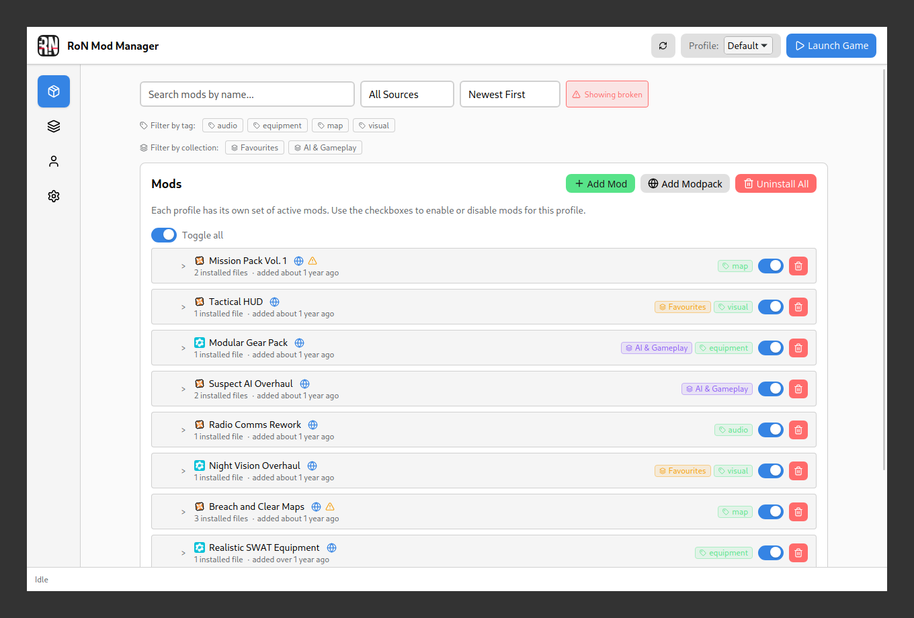
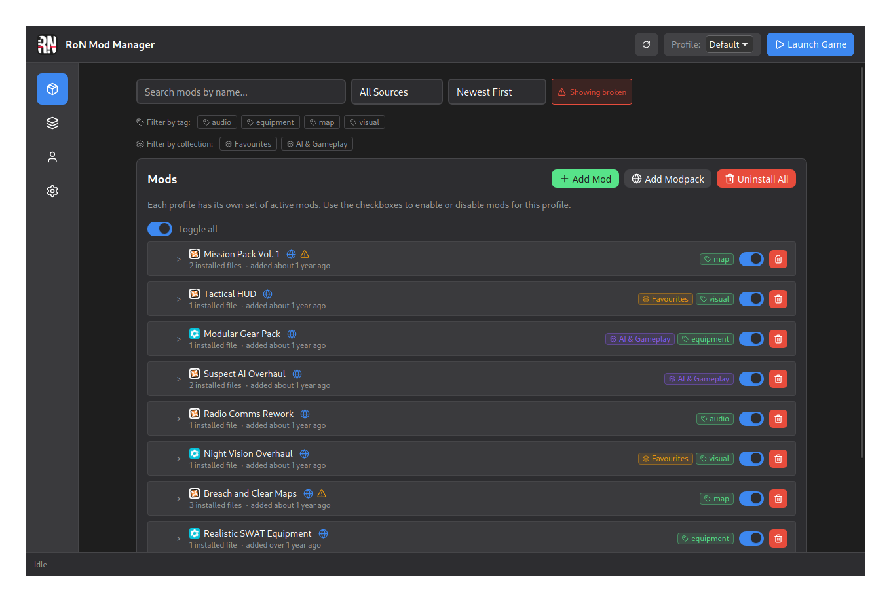

# RoN Mod Manager

Cross-platform (Linux + Windows) GUI mod manager for Ready or Not.

<table>
  <tr>
    <td></td>
    <td></td>
  </tr>
</table>

[More screenshots →](docs/screenshots/)

## Stack

- Tauri v2 (Rust backend)
- Svelte 5 + TypeScript (frontend)
- Tailwind CSS 4
- `npm` package management

## Development

```bash
make install
make dev
```

### Linux Development

```bash
make dev          # Wayland-compatible (software rendering)
make dev-xwayland # XWayland mode (full window state persistence)
```

See [docs/LINUX_WINDOW_PERSISTENCE.md](docs/LINUX_WINDOW_PERSISTENCE.md) for details on window state persistence on Linux/Wayland.

## Quality Checks

```bash
make lint-all        # all linters (frontend + backend)

# or individually:
make lint-frontend   # Prettier check + svelte-check
make lint-backend    # cargo fmt --check + clippy
make test            # vitest + cargo test
```

## Screenshots

To regenerate the screenshots in `docs/screenshots/`, install the prerequisites once:

```bash
sudo dnf install xdotool imagemagick   # Fedora / Nobara
sudo apt install xdotool imagemagick   # Debian / Ubuntu
```

The script runs the app in XWayland mode (`GDK_BACKEND=x11`) so xdotool can control the window. XWayland starts automatically on KDE Plasma.

Build the debug binary once (or after any Rust changes):

```bash
make screenshots-build
```

Then retake screenshots any time — frontend changes are picked up automatically without a rebuild:

```bash
make screenshots
```

The script starts the Vite dev server, launches the debug binary (which connects to it), and runs twice — once for light mode and once for dark — saving to `docs/screenshots/light/` and `docs/screenshots/dark/`. The app launches with `SCREENSHOT_MODE=1` (incognito auto-activated, no setup wizard, no geometry restore) and each sidebar page is navigated and captured via xdotool + ImageMagick.

## Keyboard Shortcuts

| Shortcut | Action                                                                    |
| -------- | ------------------------------------------------------------------------- |
| `Ctrl+I` | Toggle incognito mode (replaces mod list with dummy data for screenshots) |

## Auto-Update Setup (GitHub Releases)

This project is configured for Tauri updater using:

- `src-tauri/tauri.conf.json` updater endpoint: `https://github.com/savagecore/RoNModManager/releases/latest/download/latest.json`
- `src-tauri/tauri.conf.json` application identifier: `uk.savagecore.ronmodmanager`
- `bundle.createUpdaterArtifacts = true`
- GitHub Actions release workflow signing env vars

Before shipping updater-enabled builds:

1. Generate updater keys once:

```bash
npm run tauri signer generate -w ~/.tauri/ronmodmanager.key
```

2. Copy the generated public key into `src-tauri/tauri.conf.json` `plugins.updater.pubkey`.
3. Add repository secrets:
   - `TAURI_SIGNING_PRIVATE_KEY`
   - `TAURI_SIGNING_PRIVATE_KEY_PASSWORD` (optional if key has no password)

Without the correct public key and signing secrets, update checks/install will fail verification.

## Installing on Linux (Flatpak)

### Via Flatpak remote (recommended)

The app is distributed via a self-hosted Flatpak remote on GitHub Pages. This gives you automatic updates through GNOME Software, Flatpost, or `flatpak update`.

```bash
# Import the signing key and add the remote (once)
curl -sL https://savagecore.github.io/RoNModManager/ronmodmanager-flatpak.gpg \
  -o /tmp/ronmodmanager-flatpak.gpg
flatpak remote-add --user \
  --gpg-import=/tmp/ronmodmanager-flatpak.gpg \
  ronmodmanager https://savagecore.github.io/RoNModManager/

# Install
flatpak install ronmodmanager uk.savagecore.ronmodmanager

# Update (or use GNOME Software / Flatpost)
flatpak update uk.savagecore.ronmodmanager
```

### Via bundle (alternative)

Download `ronmodmanager.flatpak` from the [latest release](https://github.com/SavageCore/RoNModManager/releases/latest):

```bash
flatpak install --user --bundle ronmodmanager.flatpak
```

## Flatpak Packaging

Flatpak support is defined in:

- `packaging/flatpak/uk.savagecore.ronmodmanager.yml`
- `packaging/flatpak/uk.savagecore.ronmodmanager.desktop`
- `packaging/flatpak/ronmodmanager-flatpak.gpg` — public signing key

CI release builds publish the OSTree repo to [GitHub Pages](https://savagecore.github.io/RoNModManager/) and upload a `.flatpak` bundle as a release asset.

> **Note:** GitHub Pages must be enabled in the repository settings (Settings → Pages → Source: Deploy from branch `gh-pages`).

Local Flatpak build:

```bash
make flatpak-deps    # install runtimes once
make flatpak         # vendor → build → bundle → install
```

Run the installed Flatpak:

```bash
make flatpak-run
```

## Versioning

Version is stored in three files (`package.json`, `src-tauri/tauri.conf.json`, `src-tauri/Cargo.toml`).
Use `npm version` to bump all three at once:

```bash
npm version patch   # 0.0.0 -> 0.0.1
npm version minor   # 0.0.0 -> 0.1.0
npm version major   # 0.0.0 -> 1.0.0
```

The `version` hook syncs `tauri.conf.json` and `Cargo.toml`. Git commit and tag are skipped (`.npmrc` sets `git-tag-version=false`) - commit and tag manually after.

## License

MIT

## Modpack Export & Hosting

See [docs/HOSTING_MODPACKS.md](docs/HOSTING_MODPACKS.md) for instructions on exporting, self-hosting, and sharing modpacks.

## Userscript

A userscript is available to add a one-click "Install via RoN Mod Manager" button to mod pages on Nexus Mods and mod.io, making browser-based mod installs seamless.

- Source: `userscript/src/main.ts`
- Built script: `userscript/dist/ron-mod-manager-userscript.user.js`

### How to install

1. Install a userscript manager such as [Violentmonkey](https://violentmonkey.github.io/).
2. [**Install Userscript**](https://github.com/SavageCore/RoNModManager/releases/latest/download/ron-mod-manager-userscript.user.js)

### Building & Release

- To build locally for testing, run `npm run build` in the `userscript/` directory. The output will be in `userscript/dist/`.
- For releases, simply create a new release or tag as usual. The main release workflow will automatically build the userscript and attach the `.user.js` file to the release.

> **Note:** The userscript will auto-update when installed from the official GitHub Releases link, thanks to the included `@updateURL` metadata.
